<!-- _class: lead
transition: fade 500ms
-->
 
# How to *automate* Grafana dashboard *analysis*

## Viacheslav Smirnov

---

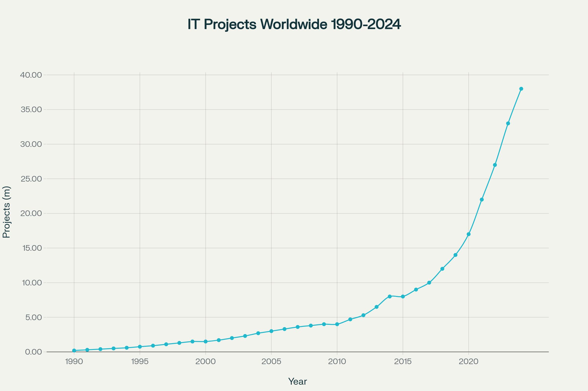

---

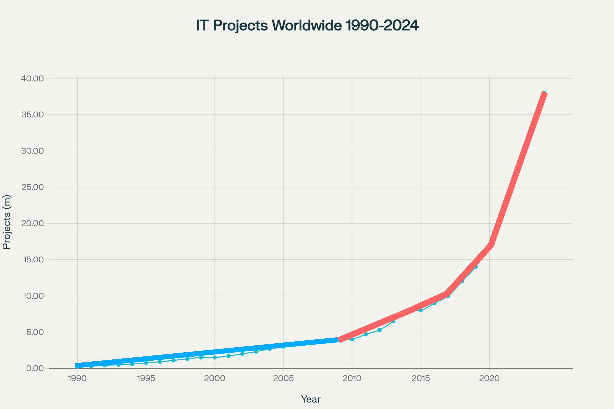

---

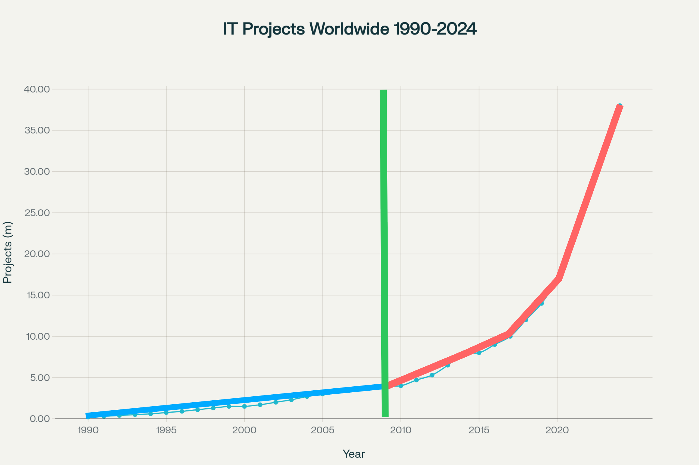

---

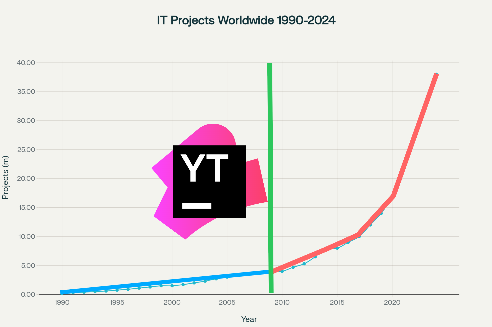

---

<!--
_transition: cube 1000ms
-->

# How to *automate*

- ## Generation via **jsonnet**
- ## **Visual hints** for analysis
- ## Alerts, run-books, links, snapshots and issues


---

<!--
_transition: melt 1000ms
-->

# Dashboards as code
## with **jsonnet**

- ## GitOps
- ## Query management
- ## Design patterns
- github.com/polarnik/grafana-analysis-automation
- polarnik.github.io/grafana-analysis-automation/


---

<!-- _class: lead
_transition: cube 1000ms
-->

# Dashboards as code 
# *Demo*

---

# Visual hints

- ## Change points
- ## Priorities
- ## Navigation

---

# Visual hints

- ## **Change points**
- ## Priorities
- ## Navigation

---


# **Change points** will show the most important events

- ## Releases
- ## Restarts
- ## Settings updates

---

<!-- _class: lead
-->

# 💡 Top level panel with _Versions_ can show **Release** moments

---

<!-- _class: lead
_transition: melt 1000ms
-->

# 💡 _Annotations_ can show **Restarts** and **Settings updates**


---

<!-- _class: lead
-->

# Change points 
# *Demo*


---

<!-- _class: lead
-->

# Next step: to use a *Rollback plan*

---

<!-- _class: lead
-->

# Next step: to make a *hot-fix*

---

<!-- _class: dark
_transition: cube 1000ms
-->

# Automation of adding **Change points**

- ## **Create** a jsonnet *library* for versions and annotations
- ## **Include** the library into dashboards
- ## **Regenerate** dashboards

---

# Visual hints

- ## Change points
- ## **Priorities**
- ## Navigation

---

# **Priorities** will highlight bottlenecks

- ## Simple dashboards
- ## TOPs
- ## Gradients

---

# **Priorities** will highlight bottlenecks

- ## **Simple dashboards**
- ## TOPs
- ## Gradients

---

# Meta dashboards

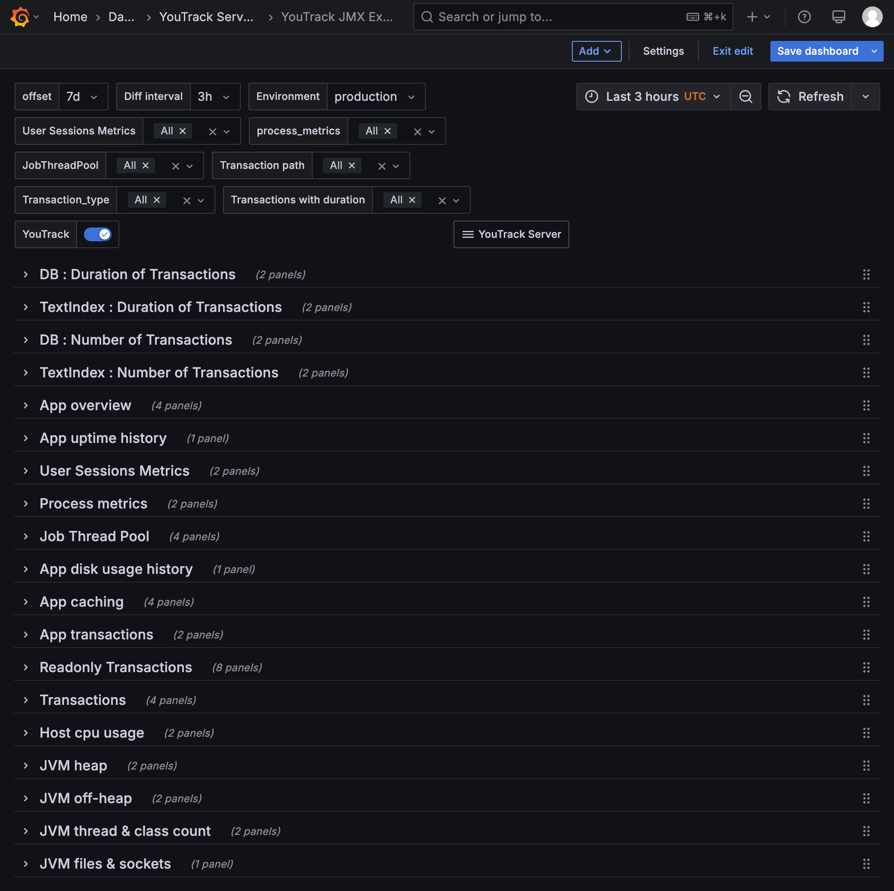
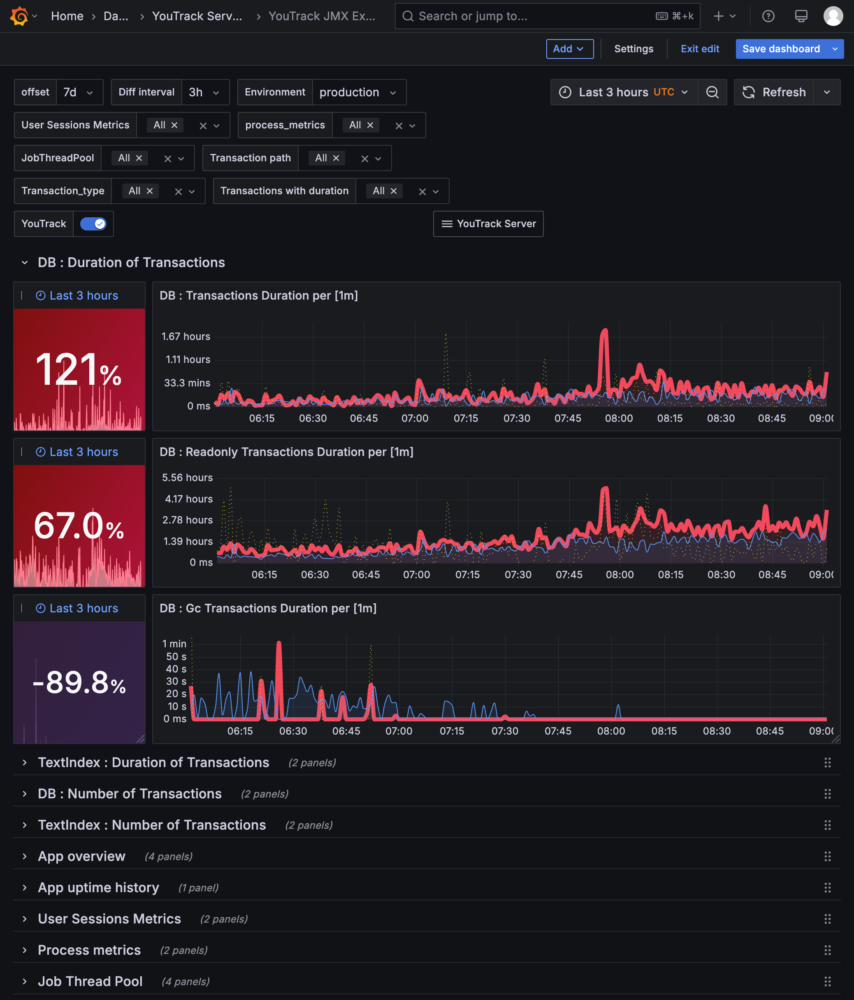

---
# Simple dashboards

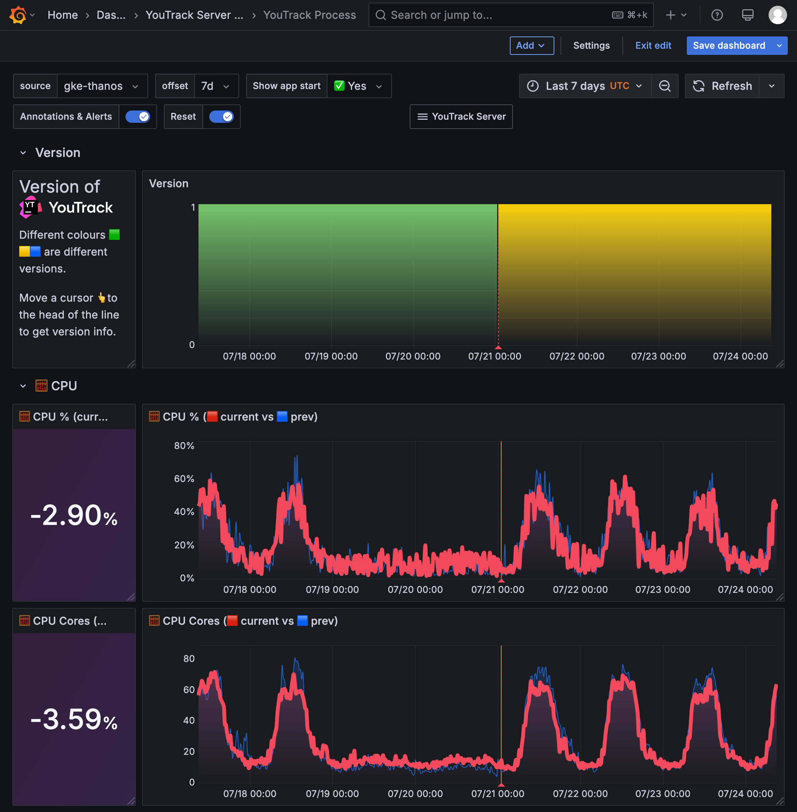
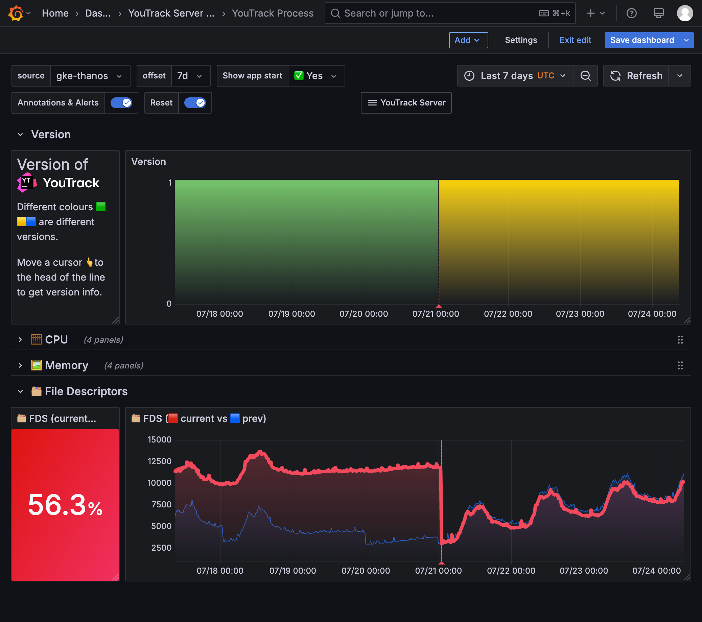

---

# **Simple**, small, fast, opened dashboards

# are my favorite


---

<!-- _class: dark
_transition: cube 1000ms
-->

# Automation of making **simple** dashboards

```jsonnet
      row.new('🗂 File Descriptors'),
      
      panels.combo.stat.a_bigger_value_is_a_problem(
        '🗂 FDS', 
        queries.diff_over_time(queries.process.open_fds)
      ),
      
      panels.combo.timeSeries.current_vs_prev(
        '🗂 FDS', 
        queries.start_prev_current_diff(queries.process.open_fds), 
        queries.process.open_fds.unit
      ),
```

---

# **Priorities** will highlight bottlenecks

- ## Simple dashboards
- ## **TOPs**
- ## Gradients

---

# TOPs in **Tables** are my favorite
## We can **sort** by the **Total Duration**

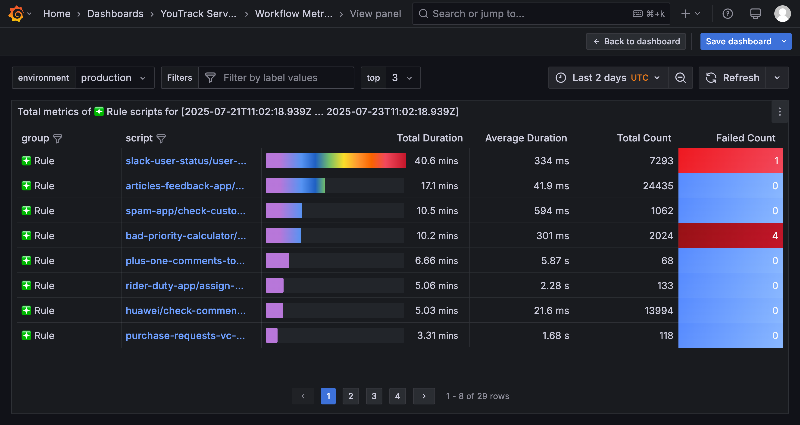

---

# TOPs in **Legends** is the easiest way
## We can **sort** by **Mean**

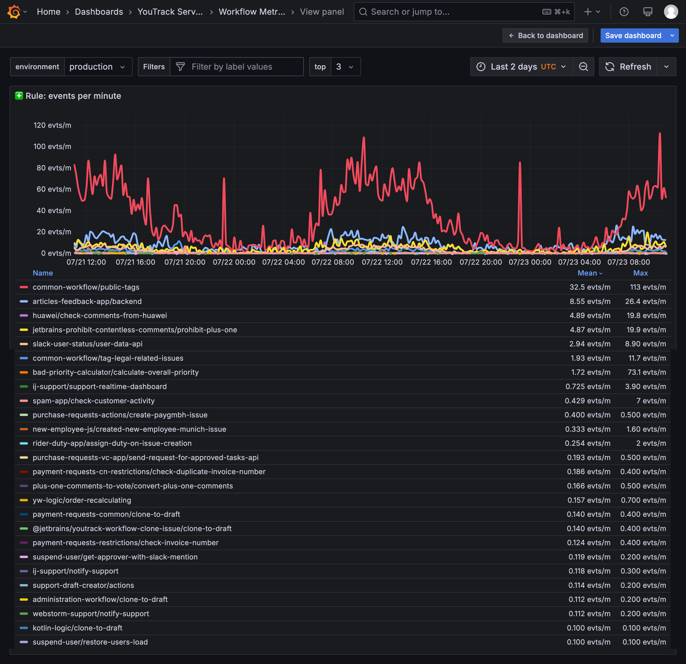

---

# TOPs in **Time Series**

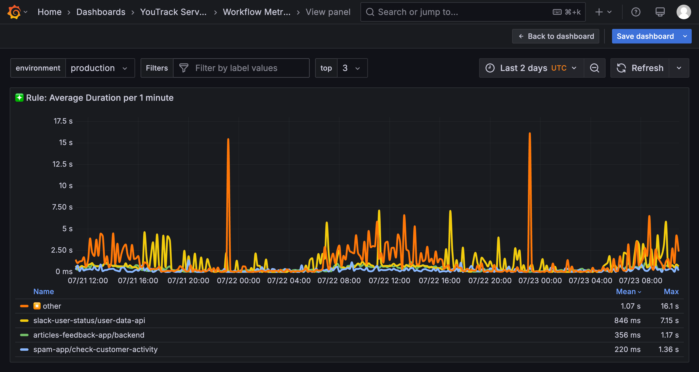

---

<!-- _class: dark
-->

# Automation of getting **TOP** series

```promql
sort_desc(    
  topk($top,        
    sum_over_time(
      (                
        sum(increase(                            
            youtrack_Workflow_OnScheduleFull_TotalDuration{
              instance=~"$instance"
            }[2m]                    
          )                
        ) by (script)            
      )[$__range:2m]        
)))
```


---

<!-- _class: dark
-->

# Automation of getting **TOP** series

```promql
sort_desc(    
  topk($top,        
    sum_over_time(  
```
```pl
      (                
        sum(increase(                            
            youtrack_Workflow_OnScheduleFull_TotalDuration{
              instance=~"$instance"
            }[2m]                    
          )                
```
```promql
        ) by (script)            
```
```pl
      )[$__range:2m]        
```
```promql
)))
```

---

# **Priorities** will highlight bottlenecks

- ## Simple dashboards
- ## TOPs
- ## **Gradients**

---

<!-- _class: dark -->

# <b style="color:#FF0000">Red colors</b> will highlight bottlenecks

- <h1><em class="Blue_White_Red">Blue-White-Red</em></h1>
- <h1><em class="Blue_Red">Blue-Red</em></h1>
- <h1><em class="Rainbow">Rainbow</em></h1>
- <h1><em class="White_Rainbow">White-Rainbow</em></h1>

---

<!-- _class: dark
_transition: melt 1000ms
-->

# Automation of changing **themes** via flags 

```java
colors: 
  if (std.extVar("EXT_THEME") == "blue_white_red") then
    self.blue_white_red
  else if (std.extVar("EXT_THEME") == "blue_red") then
    self.blue_red
  else if (std.extVar("EXT_THEME") == "rainbow") then
    self.rainbow
  else if (std.extVar("EXT_THEME") == "white_rainbow") then
    self.white_rainbow
  else
    self.blue_white_red,
```


---

<!-- _class: lead dark
_transition: cube 1000ms
-->

# *Demo*

## Simple dashboards with TOPs and Gradients

---

# Visual hints

- ## Change points
- ## Priorities
- ## *Navigation*

---


# *Navigation* will save your time

- ## Summary and Templates
- ## Links
- ## Schemas


---

# Navigation via Drill-Down

- ## Summary dashboard 
  - ## uses **Tables** and **Stat** panels
- ## Template dashboards 
  - ## use **Time series** with **Text** variables

---

# **Links** will connect relevant dashboards

- ## Table cells links through *Data links*
- ## Stats panel links through *Data links*
- ## Dashboard links through *Tags*
- ## Diagram Links through *Actions*
- ## Text Links through *HTML* or *Markdown*

---


<!--
_transition: melt 1000ms
-->

# **Schemas** will visualize connections

- ## The Diagram plugin with **Mermaid.js** Flowchart
- ## The Text panel with images of **Miro** diagrams

---

<!-- _class: lead
_transition: cube 1000ms
-->

# Navigation
# *Demo*

---

# Hints for automation analysis

## Run-books

- ## Runbook templates
- ## Runbook-first alerts
- ## Markdown pages: Writerside, Hugo

---

# Hints for automation analysis

## Links in Alerts

- ## The runbook link
- ## Dashboard links with Time ranges
- ## Issue links

---

<!--
_transition: melt 1000ms
-->

# Hints for automation analysis

## Grafana **Snapshots**

- ## perfana/perfana-snapshot
- ## Sonnet 3.7, Sonnet 4.0
- ## Google Gemini 2.5 Pro

---

<!-- _class: lead dark
_transition: cube 1000ms
-->

# Hints for automation analysis

# *Demo*

---

<!-- _class: dark
-->


# Smirnov Viacheslav or **Slava**

- ## perf**qa** (linkedin)
- ## **perf**track (grafana)
- ## smirnov**qa** (telegram)
- ## **qa**positive (gmail)
- ## polarnik (github)
