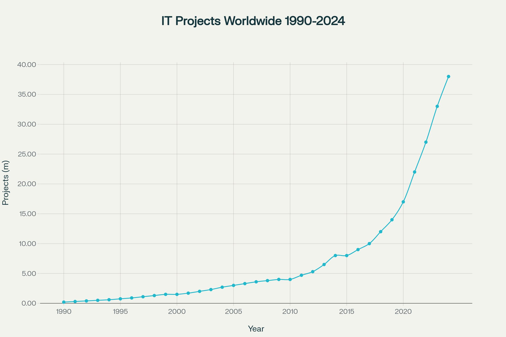
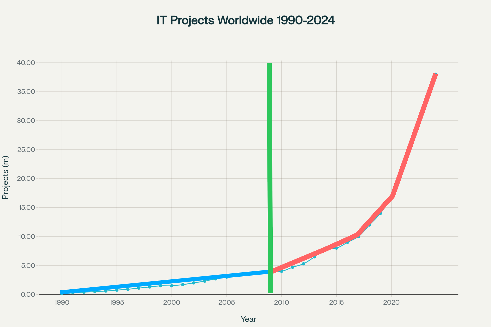
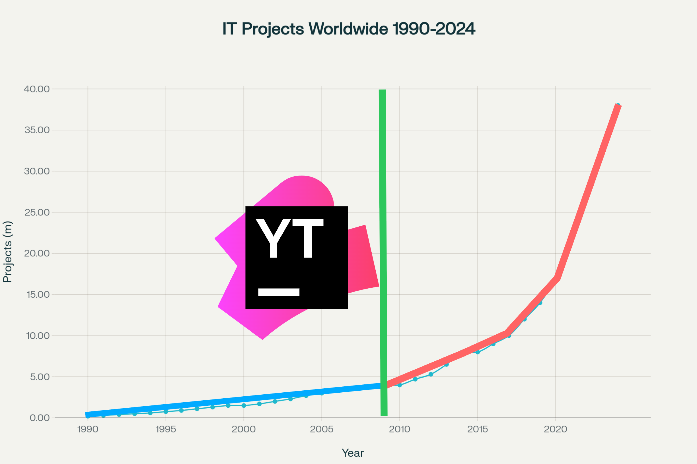

<!-- _class: lead
_transition: fade 300ms
-->
 
# How to *automate* Grafana dashboard *analysis*

## Viacheslav Smirnov

---

---

---

---

---

# How to *automate*

- generation via **jsonnet**
- **visual hints** for manual analysis
- alerts, run-books, links, snapshots, ai run-books and issues

---

# Dashboards as code

- ## GitOps
- ## Query management
- ## Design patterns
- github.com/polarnik/grafana-analysis-automation

---

# Dashboards as code 🚀 *Demo*

- ## GitOps
- ## Query management
- ## Design patterns

---

---
<!-- _class: lead -->

# Sleep, Hike, *Automate*

---

<!-- _class: lead
-->

# Analysis

## complex ➞ parts

---

<!-- _class: lead
-->

# Automate

## Grafana hack, tools, LLM

---

# _YouTrack_ is a self-hosted service

* __140__ YouTrack metrics

* __040__ JVM metrics
* __005__ NGinx metrics
* __020__ Docker metrics
* __100__ Linux metrics

---

<!-- _class: lead
-->

# How to align metrics with _Releases_

---

<!-- _class: lead
-->

# How to align metrics with _Releases_

## 💡 Top level panel

---

<!-- _class: lead
-->

# How to align metrics with _Restarts_

---

<!-- _class: lead
-->

# How to align metrics with __Restarts__

## 💡 Annotations

---

<!-- _class: lead
-->

# How to align metrics with __Restarts__

## 💡 Additional Query

---

<!-- _class: lead
-->

# How to detect __anomalies__

---

<!-- _class: lead
-->

# How to detect __anomalies__

## 💡 The Offset variable and a new query

---

<!-- _class: lead
-->

# How to detect __anomalies__

## 💡 Stats panel timelapse

---

<!-- _class: lead
-->

# How to detect anomalies

## 💡 Queries for 1-4 weeks offsets

---

<!-- _class: lead
-->

# How to detect anomalies

## 💡 Z-score

---

<!-- _class: lead
-->

# How to detect anomalies

## 💡 Grafana Scenes + @grafana/scenes-ml

---

<!-- _class: lead
-->

# How to use Gradients in Grafana

---

<!-- _class: lead
-->

# How to use Gradients in Grafana

## Blue ➞ White ➞ Red
## Min ➞ 0 ➞ Max

---

<!-- _class: lead
-->

# How to use Gradients in Grafana

## Rainbow
## Min ➞ Max

---

<!-- _class: lead
-->

# How to use Gradients in Grafana

## Light ➞ Dark (Gatling style)
## Percentiles

---

<!-- _class: lead
-->

# How to add Diagrams

---

<!-- _class: lead
-->

# How to add Diagrams for navigation

## Text + `` + Miro

---

<!-- _class: lead
-->

# How to add Diagrams for navigation

## Diagram plugin + Mermaid.js Flowchart

---

<!-- _class: dark
-->

# Contacts

- ## perf**qa** (linkedin)
- ## **perf**track (grafana)
- ## smirnov**qa** (telegram)
- ## **qa**positive (gmail)
- ## polarnik (github)
